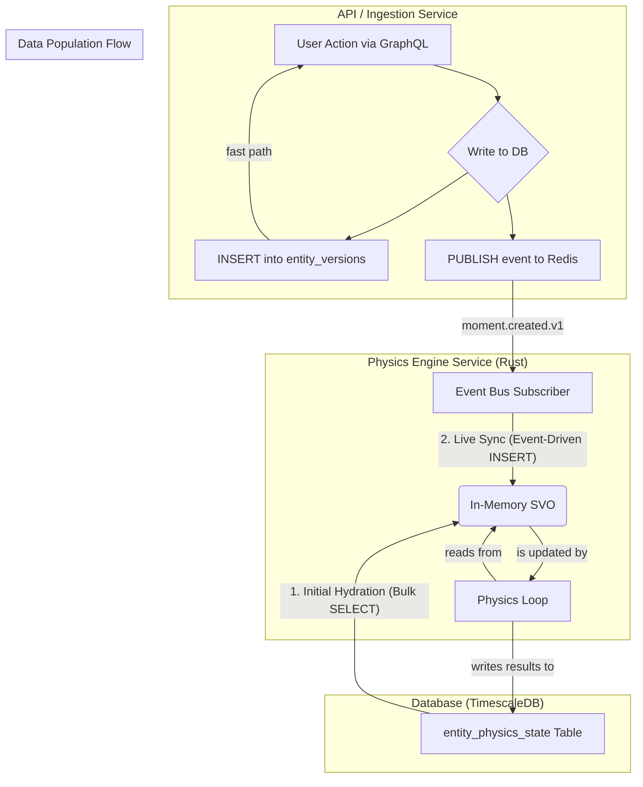

# Implementation Plan: In-Memory Sparse Voxel Octree (SVO)

*Part of the [Familiar Cognitive Physics Engine Canon](../00_overview.html) - System Architecture*

## 1. Overview

This document provides the high-level technical plan for implementing the in-memory Sparse Voxel Octree (SVO). The SVO serves as the high-performance, spatially-indexed cache for the live physics simulation. It is populated from TimescaleDB and kept synchronized via an event bus.

This plan assumes the use of a native Rust SVO library (e.g., `svo-rs`) within a dedicated "Physics Engine" service.

## 2. Core Components and Data Flow

The system consists of three main components interacting in a defined sequence:

1.  **TimescaleDB:** The persistent source of truth, specifically the `entity_physics_state` table which stores the current VAE coordinates for all entities.
2.  **Physics Engine Service:** A Rust application responsible for:
    *   Holding the SVO data structure in its own RAM.
    *   Executing the `Dual-Force Model` physics calculations.
    *   Subscribing to an event bus for live updates.
3.  **Event Bus (e.g., Redis Pub/Sub):** A lightweight message broker used to notify the Physics Engine of new entity creations that happen after its initial startup.



## 3. The Population Process

The SVO is populated in two distinct phases: initial "cold start" hydration and live synchronization.

### 3.1. Phase 1: Initial Hydration (Cold Start)

This process runs once when the Physics Engine service starts up for a given `Thread`.

1.  **Establish DB Connection:** The service connects to the TimescaleDB instance.

2.  **Execute Bulk Query:** The service executes a single, optimized SQL query to retrieve the current physical state of all relevant entities.
    ```sql
    -- Retrieve the ID and VAE coordinates for all moments in a specific thread
    SELECT
        entity_id,
        physics_components->'vae_coordinates' AS vae_coordinates
    FROM
        entity_physics_state
    WHERE
        -- This part of the query needs to identify all relevant entities for a thread
        -- This might involve a JOIN or a specific filter
        entity_id IN (SELECT entity_id FROM entities WHERE thread_id = ?);
    ```

3.  **Instantiate SVO:** A new, empty SVO structure is created in memory using the chosen Rust library.

4.  **Iterate and Insert:** The service iterates through the potentially millions of rows returned by the query. For each row, it extracts the `entity_id` and the `vae_coordinates`.

5.  **Populate SVO:** The service calls the SVO library's `insert` method, adding each entity and its coordinates to the in-memory tree. This is the most computationally intensive part of the startup, as the tree builds itself by creating nodes and branches.

6.  **Ready State:** Once all rows have been processed, the SVO is fully hydrated. The Physics Engine can now begin its simulation loop.

### 3.2. Phase 2: Live Synchronization (Event-Driven Updates)

This process runs continuously after the initial hydration to keep the cache from becoming stale.

1.  **Subscribe to Topic:** The Physics Engine service subscribes to the relevant topic on the event bus (e.g., `moment.created.v1`).

2.  **Listen for Events:** The service's event loop listens for incoming messages.

3.  **Parse Event:** When a message is received, the service parses the JSON payload to extract the new `entity_id` and its initial `vae_coordinates`. (Note: The physics state for a new entity is calculated and written to the DB by a background processor *before* this event is consumed by the main physics engine).

4.  **Update In-Memory SVO:** The service calls the SVO library's `insert` method with the data from the event. This adds the new entity to the live, in-memory tree, making it immediately visible to the ongoing physics simulation.

5.  **Idempotency:** The event handler logic must be idempotent. It should check if the `entity_id` from the event already exists in the SVO before attempting an insert to prevent duplicates from rare event re-deliveries.

## 4. Engineering Considerations

-   **Memory Footprint:** The Physics Engine service will have a significant memory requirement, directly proportional to the number of entities being simulated. This must be monitored.
-   **Startup Time:** The initial hydration phase may be slow for `Threads` with very large numbers of entities. This is an accepted trade-off for high-performance simulation.
-   **Robust Error Handling:** The service must be resilient to transient database or event bus connection failures, implementing appropriate retry logic. 