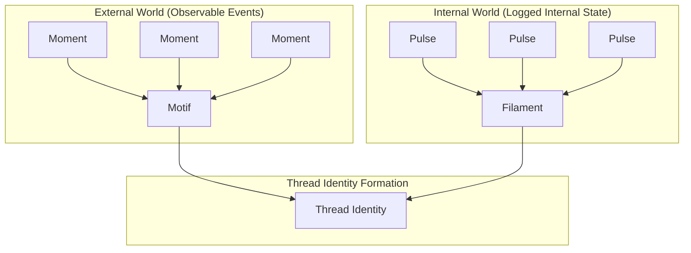
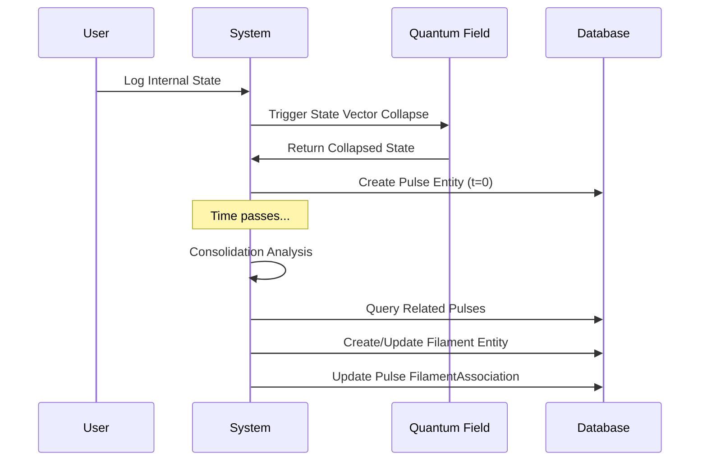
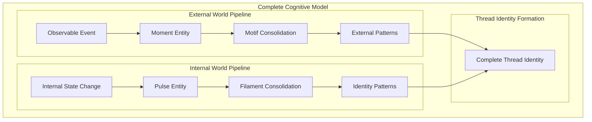

# 🫀 Pulse Entity Architecture: Completing Ontological Symmetry

*Part of the [Familiar Cognitive Physics Engine Canon](../00_overview.html) - Critical Architecture Completion*

## 🎯 **The Fundamental Asymmetry Problem**

The existing ontology had a **critical flaw** that violated the Growing Block Universe principles:

| **Domain** | **Logging Entity** | **Consolidation Entity** | **Status** |
|------------|-------------------|--------------------------|------------|
| **External World** | `Moment` ✅ | `Motif` ✅ | **Complete** |
| **Internal World** | ❌ **MISSING** | `Filament` ⚠️ | **Broken** |

### **The Problem**
- **External observations** are properly logged as `Moment` entities at t=0, then consolidated into `Motif` entities
- **Internal state changes** had NO logging mechanism - `Filament` entities were created "magically" from retroactive analysis
- This **violates GBU principles** - all entities must be created at the "now" plane, not retroactively

### **The Insight**
*"If motifs summarize moments, but filaments only summarize themselves, we've lost parity"*

The system needed a **discrete logging object for internal state** to provide the raw material for `Filament` consolidation, just as `Moment` provides raw material for `Motif`.

---

## 💡 **The Solution: Pulse Entity**

The **Pulse entity** completes the ontological symmetry:



### **Perfect Symmetry Achieved**

| **Aspect** | **External World** | **Internal World** |
|------------|-------------------|-------------------|
| **Logging Entity** | `Moment` | `Pulse` |
| **Purpose** | Snapshot of external world | Snapshot of internal state |
| **Consolidation** | → `Motif` | → `Filament` |
| **Physics Event** | Observation collapse | State vector collapse |
| **Created At** | t=0 (now plane) | t=0 (now plane) |
| **GBU Compliance** | ✅ Proper temporal logging | ✅ Proper temporal logging |

---

## 📋 **Pulse Entity Schema Definition**

### **Core Entity Schema**

**File**: `docs/v3/schemas/entities/Pulse.schema.json`

```json
{
  "$schema": "https://json-schema.org/draft/2020-12/schema",
  "$id": "https://familiar.dev/schemas/entities/Pulse.v1.json",
  "$comment": "Entity representing a discrete log of internal state at a specific moment",
  "title": "Pulse Entity",
  "description": "Discrete logging entity for internal state changes, providing raw material for Filament consolidation.",
  "allOf": [{ "$ref": "../_base/BaseCognitiveEntity.schema.json" }],
  "schema_version": "1.0.0",
  "ontology": {
    "domain": "internal_world",
    "logging_type": "state_vector_snapshot",
    "consolidation_target": "Filament",
    "temporal_creation": "now_plane_only"
  },
  "required_components": [
    {
      "component_name": "PulseContent",
      "description": "The logged internal state data",
      "schema_ref": "../components/PulseContent.schema.json"
    },
    {
      "component_name": "QuantizedManifoldPosition", 
      "description": "3D cognitive space position (Valence-Arousal-Epistemic)",
      "schema_ref": "../components/QuantizedManifoldPosition.schema.json"
    },
    {
      "component_name": "UniversalPhysicsState",
      "description": "Physics state for quantum field interactions",
      "schema_ref": "../components/UniversalPhysicsState.schema.json"
    }
  ],
  "optional_components": [
    {
      "component_name": "QuantumState",
      "description": "Quantum state information if entity participates in quantum processing",
      "schema_ref": "../components/QuantumState.schema.json"
    },
    {
      "component_name": "FilamentAssociation",
      "description": "Association with consolidated Filament entities",
      "schema_ref": "../components/FilamentAssociation.schema.json"
    }
  ],
  "physics_integration": {
    "quantum_event_type": "state_vector_collapse",
    "field_excitation": "internal_state_resonance",
    "consolidation_physics": "filament_formation_dynamics"
  }
}
```

### **PulseContent Component Schema**

**File**: `docs/v3/schemas/components/PulseContent.schema.json`

```json
{
  "$schema": "https://json-schema.org/draft/2020-12/schema",
  "$id": "https://familiar.dev/schemas/components/PulseContent.v1.json",
  "title": "Pulse Content Component",
  "description": "Content component for Pulse entities - captures logged internal state at a moment in time.",
  "allOf": [{ "$ref": "../_base/BaseComponent.schema.json" }],
  "schema_version": "1.0.0",
  "fields": {
    "internal_state_type": {
      "description": "Type of internal state being logged.",
      "$ref": "../snippets/types/internal/InternalStateType.json"
    },
    "state_description": {
      "description": "Human-readable description of the internal state.",
      "type": "string",
      "maxLength": 2000
    },
    "cognitive_coordinates": {
      "description": "3D cognitive space coordinates (Valence-Arousal-Epistemic) - stored in physics state, not as separate fields.",
      "$ref": "../snippets/types/physics/CognitiveCoordinates3D.json"
    },
    "confidence_level": {
      "description": "User's confidence in accurately capturing this internal state.",
      "$ref": "../snippets/types/primitives/ConfidenceLevel.json"
    },
    "state_intensity": {
      "description": "Intensity/strength of this internal state.",
      "$ref": "../snippets/types/primitives/IntensityLevel.json"
    },
    "triggering_context": {
      "description": "Optional context about what triggered this internal state.",
      "oneOf": [
        {
          "type": "object",
          "properties": {
            "moment_reference": {
              "description": "Reference to a Moment that triggered this internal state.",
              "$ref": "../snippets/types/primitives/EntityReference.json"
            },
            "pulse_reference": {
              "description": "Reference to another Pulse that triggered this internal state.",
              "$ref": "../snippets/types/primitives/EntityReference.json"  
            },
            "external_trigger": {
              "description": "Description of external trigger not captured in a Moment.",
              "type": "string",
              "maxLength": 500
            }
          }
        },
        { "type": "null" }
      ],
      "default": null
    },
    "metadata": {
      "description": "Additional metadata about the pulse logging event.",
      "$ref": "../snippets/types/metadata/PulseMetadata.json"
    }
  }
}
```

### **Supporting Type Definitions**

#### **Internal State Type**

**File**: `docs/v3/schemas/snippets/types/internal/InternalStateType.json`

```json
{
  "description": "Types of internal state that can be logged in a Pulse.",
  "enum": [
    "emotional_shift",
    "realization", 
    "identity_insight",
    "value_clarification",
    "goal_formation",
    "belief_change",
    "memory_activation",
    "attention_shift",
    "energy_change",
    "mood_transition",
    "cognitive_load_change",
    "motivation_shift",
    "self_concept_update",
    "relational_awareness",
    "existential_moment",
    "creative_inspiration",
    "decision_formation",
    "clarity_emergence",
    "confusion_onset",
    "other"
  ]
}
```

#### **Filament Association Component**

**File**: `docs/v3/schemas/components/FilamentAssociation.schema.json`

```json
{
  "$schema": "https://json-schema.org/draft/2020-12/schema",
  "$id": "https://familiar.dev/schemas/components/FilamentAssociation.v1.json", 
  "title": "Filament Association Component",
  "description": "Associates Pulse entities with their consolidated Filament entities.",
  "allOf": [{ "$ref": "../_base/BaseComponent.schema.json" }],
  "schema_version": "1.0.0",
  "fields": {
    "consolidated_filaments": {
      "description": "List of Filament entities that have consolidated this Pulse.",
      "type": "array",
      "items": {
        "$ref": "../snippets/types/primitives/EntityReference.json"
      },
      "maxItems": 10
    },
    "consolidation_status": {
      "description": "Status of this Pulse's consolidation into Filaments.",
      "enum": ["unconsolidated", "partially_consolidated", "fully_consolidated"]
    },
    "consolidation_timestamp": {
      "description": "When this Pulse was last consolidated into a Filament.",
      "oneOf": [
        { "$ref": "../snippets/types/primitives/Timestamp.json" },
        { "type": "null" }
      ],
      "default": null
    },
    "consolidation_confidence": {
      "description": "Confidence level in the consolidation mapping.",
      "$ref": "../snippets/types/primitives/ConfidenceLevel.json"
    }
  }
}
```

---

## ⚡ **Physics Integration: State Vector Collapse**

The **Pulse entity** represents a **state vector collapse** in the quantum cognitive system:

### **Quantum Event Types**

| **Entity** | **Physics Event** | **Quantum Process** | **Field Effect** |
|------------|-------------------|---------------------|------------------|
| **Moment** | Observation collapse | External measurement | Field disturbance from outside |
| **Pulse** | State vector collapse | Internal measurement | Field resonance from within |

### **State Vector Collapse Mechanics**

```rust
// State vector collapse when logging internal state
pub fn log_pulse_state_collapse(
    thread_id: EntityId,
    internal_state: InternalStateSnapshot,
    cognitive_position: [i64; 3], // Valence-Arousal-Epistemic
) -> Result<PulseEntity, StateCollapseError> {
    
    // 1. Capture current quantum state vector
    let current_state_vector = quantum_system.get_thread_state_vector(thread_id)?;
    
    // 2. Perform state vector collapse based on internal observation
    let collapsed_state = current_state_vector.collapse_on_internal_observation(
        internal_state.state_type,
        internal_state.intensity
    )?;
    
    // 3. Create Pulse entity at t=0 (now plane) - GBU compliant
    let pulse_entity = PulseEntity {
        entity_id: EntityId::new_v4(),
        content: PulseContent::from_internal_state(internal_state),
        cognitive_position,
        physics_state: UniversalPhysicsState::from_collapsed_state(collapsed_state),
        quantum_state: Some(QuantumState::from_collapse(collapsed_state)),
        created_at: Timestamp::now(), // t=0 creation
    };
    
    // 4. Update quantum field with internal resonance (derived from 3D coordinates)
    let (emotional_valence, arousal_level, epistemic_clarity) = 
        derive_cognitive_values_from_coordinates(cognitive_position);
    
    quantum_field_system.add_internal_resonance(
        cognitive_position,
        emotional_valence,
        arousal_level,
        epistemic_clarity
    )?;
    
    Ok(pulse_entity)
}
```

### **Field Dynamics Integration**

**Internal State Resonance** in the 3D cognitive space:

- **Valence Field**: Resonates with `emotional_valence` component
- **Arousal Field**: Resonates with `arousal_level` component  
- **Epistemic Field**: Resonates with `epistemic_clarity` component

This creates **internal field dynamics** that complement the external field dynamics from `Moment` entities.

---

## 🔄 **Consolidation Flow: Pulse → Filament**

### **The Complete Logging → Consolidation Cycle**



### **Filament Formation from Pulses**

```rust
// Consolidation engine - creates Filaments from related Pulses
pub fn consolidate_pulses_to_filament(
    thread_id: EntityId,
    pulse_cluster: Vec<PulseEntity>,
    consolidation_threshold: f64,
) -> Result<FilamentEntity, ConsolidationError> {
    
    // Analyze commonalities across pulse cluster
    let common_patterns = analyze_pulse_patterns(&pulse_cluster)?;
    
    // Create Filament that represents the consolidated pattern
    let filament = FilamentEntity {
        entity_id: EntityId::new_v4(),
        content: FilamentContent {
            identity_pattern: common_patterns.identity_theme,
            emotional_signature: common_patterns.emotional_pattern,
            behavioral_tendency: common_patterns.behavioral_pattern,
            consolidation_confidence: common_patterns.confidence_score,
        },
        source_pulses: pulse_cluster.iter().map(|p| p.entity_id).collect(),
        thread_id,
        created_at: Timestamp::now(),
    };
    
    // Update all source Pulses with filament association
    for pulse in &pulse_cluster {
        update_pulse_filament_association(pulse.entity_id, filament.entity_id)?;
    }
    
    Ok(filament)
}
```

---

## ⚙️ **3D Physics State Integration**

### **Coordinate Conversion: Cognitive Values ↔ 3D Space**

The emotional/arousal/epistemic values are **not stored as separate database fields**. Instead, they are **encoded directly into the 3D cognitive space coordinates** to maintain physics consistency.

#### **Conversion Mechanics**

```rust
// Convert user input (-1.0 to 1.0) to quantized coordinates
pub fn cognitive_values_to_coordinates(
    emotional_valence: f64,  // -1.0 to 1.0
    arousal_level: f64,      // -1.0 to 1.0  
    epistemic_clarity: f64,  // -1.0 to 1.0
) -> [i64; 3] {
    const COORDINATE_SCALE: i64 = 10_000_000; // -10M to +10M range
    
    [
        (emotional_valence * COORDINATE_SCALE as f64) as i64,  // valence_coordinate
        (arousal_level * COORDINATE_SCALE as f64) as i64,      // arousal_coordinate  
        (epistemic_clarity * COORDINATE_SCALE as f64) as i64,  // epistemic_coordinate
    ]
}

// Convert quantized coordinates back to cognitive values for agent use
pub fn coordinates_to_cognitive_values(coordinates: [i64; 3]) -> (f64, f64, f64) {
    const COORDINATE_SCALE: f64 = 10_000_000.0;
    
    (
        coordinates[0] as f64 / COORDINATE_SCALE, // emotional_valence
        coordinates[1] as f64 / COORDINATE_SCALE, // arousal_level
        coordinates[2] as f64 / COORDINATE_SCALE, // epistemic_clarity
    )
}
```

#### **Physics Consistency Benefits**

| **Aspect** | **Before (Separate Fields)** | **After (3D Physics State)** |
|------------|------------------------------|------------------------------|
| **Storage** | Duplicate data (coordinates + values) | Single source of truth (coordinates only) |
| **Physics** | Values disconnected from space | Values **ARE** the spatial position |
| **Search** | Query both coordinates and values | Query coordinates, derive values |
| **Consistency** | Risk of coordinate/value mismatch | **Impossible to be inconsistent** |
| **Agent Access** | Direct field access | Computed values from coordinates |

#### **Agent-Friendly Computed Properties**

Agents can still access the cognitive values through **computed properties**:

```rust
impl PulseEntity {
    // Agents can access these values, but they're computed from 3D coordinates
    pub fn emotional_valence(&self) -> f64 {
        let (valence, _, _) = coordinates_to_cognitive_values(self.cognitive_position);
        valence
    }
    
    pub fn arousal_level(&self) -> f64 {
        let (_, arousal, _) = coordinates_to_cognitive_values(self.cognitive_position);
        arousal  
    }
    
    pub fn epistemic_clarity(&self) -> f64 {
        let (_, _, epistemic) = coordinates_to_cognitive_values(self.cognitive_position);
        epistemic
    }
    
    // Agents can also search by approximate cognitive ranges
    pub fn find_pulses_by_emotional_range(
        valence_min: f64, valence_max: f64
    ) -> Result<Vec<PulseEntity>, QueryError> {
        let coord_min = (valence_min * 10_000_000.0) as i64;
        let coord_max = (valence_max * 10_000_000.0) as i64;
        
        // Query by coordinate range, not separate valence field
        query_pulses_by_valence_coordinate_range(coord_min, coord_max)
    }
}
```

#### **Search Strategy: Coordinate-Based Queries**

Agents can find Pulses using **3D spatial queries** rather than separate field searches:

```sql
-- Find Pulses in a "positive emotional, low arousal, high clarity" region
SELECT * FROM pulse_entities 
WHERE valence_coordinate BETWEEN 5000000 AND 10000000     -- +0.5 to +1.0 valence
  AND arousal_coordinate BETWEEN -5000000 AND 0           -- -0.5 to 0.0 arousal  
  AND epistemic_coordinate BETWEEN 7000000 AND 10000000;  -- +0.7 to +1.0 clarity

-- Find Pulses within a 3D "emotional neighborhood" 
SELECT * FROM pulse_entities
WHERE sqrt(power(valence_coordinate - :target_valence, 2) + 
           power(arousal_coordinate - :target_arousal, 2) + 
           power(epistemic_coordinate - :target_epistemic, 2)) < :radius;
```

---

## 📊 **Database Schema Updates**

### **New Tables for Pulse Support**

```sql
-- Pulse entities table (new)
CREATE TABLE IF NOT EXISTS pulse_entities (
    entity_id UUID PRIMARY KEY,
    thread_id UUID NOT NULL,
    
    -- 3D cognitive space position
    valence_coordinate BIGINT CHECK (valence_coordinate BETWEEN -10000000 AND 10000000),
    arousal_coordinate BIGINT CHECK (arousal_coordinate BETWEEN -10000000 AND 10000000), 
    epistemic_coordinate BIGINT CHECK (epistemic_coordinate BETWEEN -10000000 AND 10000000),
    
    -- Pulse content (cognitive coordinates stored in 3D physics state, not as separate fields)
    internal_state_type TEXT NOT NULL,
    state_description TEXT,
    confidence_level FLOAT CHECK (confidence_level BETWEEN 0.0 AND 1.0),
    state_intensity FLOAT CHECK (state_intensity BETWEEN 0.0 AND 1.0),
    
    -- Consolidation tracking
    consolidation_status TEXT DEFAULT 'unconsolidated',
    consolidation_timestamp TIMESTAMPTZ,
    
    -- Standard temporal tracking
    created_at TIMESTAMPTZ NOT NULL DEFAULT NOW(),
    tenant_id UUID NOT NULL,
    
    FOREIGN KEY (thread_id) REFERENCES thread_entities(entity_id),
    CONSTRAINT valid_consolidation_status CHECK (consolidation_status IN ('unconsolidated', 'partially_consolidated', 'fully_consolidated'))
);

-- Pulse-Filament associations table
CREATE TABLE IF NOT EXISTS pulse_filament_associations (
    pulse_id UUID NOT NULL,
    filament_id UUID NOT NULL,
    consolidation_confidence FLOAT CHECK (consolidation_confidence BETWEEN 0.0 AND 1.0),
    created_at TIMESTAMPTZ NOT NULL DEFAULT NOW(),
    
    PRIMARY KEY (pulse_id, filament_id),
    FOREIGN KEY (pulse_id) REFERENCES pulse_entities(entity_id),
    FOREIGN KEY (filament_id) REFERENCES filament_entities(entity_id)
);

-- Indexes for performance
CREATE INDEX idx_pulse_entities_thread_created ON pulse_entities(thread_id, created_at);
CREATE INDEX idx_pulse_entities_consolidation_status ON pulse_entities(consolidation_status) WHERE consolidation_status = 'unconsolidated';
CREATE INDEX idx_pulse_entities_cognitive_space ON pulse_entities(valence_coordinate, arousal_coordinate, epistemic_coordinate);
```

### **Updated Filament Entities Table**

```sql
-- Add source pulse tracking to existing filament_entities table
ALTER TABLE filament_entities 
ADD COLUMN source_pulse_count INTEGER DEFAULT 0,
ADD COLUMN latest_pulse_timestamp TIMESTAMPTZ,
ADD COLUMN consolidation_method TEXT DEFAULT 'pulse_analysis';
```

---

## 🎯 **User Experience: Pulse Logging**

### **Pulse Creation Interface**

```typescript
// GraphQL mutation for creating Pulse entities
type Mutation {
  logInternalState(input: PulseInput!): PulseCreationResult!
}

input PulseInput {
  threadId: UUID!
  internalStateType: InternalStateType!
  stateDescription: String!
  # Cognitive coordinates (Valence-Arousal-Epistemic) computed from user input, not direct fields
  cognitiveState: CognitiveStateInput!  
  confidenceLevel: Float   # 0.0 to 1.0
  stateIntensity: Float    # 0.0 to 1.0
  triggeringContext: TriggeringContextInput
}

input CognitiveStateInput {
  emotionalValence: Float  # -1.0 to 1.0 (maps to valence_coordinate)
  arousalLevel: Float      # -1.0 to 1.0 (maps to arousal_coordinate)
  epistemicClarity: Float  # -1.0 to 1.0 (maps to epistemic_coordinate)
}

type PulseCreationResult {
  pulse: Pulse!
  cognitivePosition: CognitivePosition3D!
  stateVectorCollapse: StateCollapseResult!
  fieldResonance: FieldResonanceResult!
}
```

### **Example Pulse Logging Scenarios**

#### **Emotional Shift Pulse**
```json
{
  "internalStateType": "emotional_shift",
  "stateDescription": "Feeling a deep sense of calm after finishing the difficult conversation",
  "cognitiveState": {
    "emotionalValence": 0.7,    // → valence_coordinate: +7000000
    "arousalLevel": -0.4,       // → arousal_coordinate: -4000000  
    "epistemicClarity": 0.8     // → epistemic_coordinate: +8000000
  },
  "confidenceLevel": 0.9,
  "stateIntensity": 0.6,
  "triggeringContext": {
    "momentReference": "moment_uuid_difficult_conversation"
  }
}
```

#### **Identity Insight Pulse**
```json
{
  "internalStateType": "identity_insight", 
  "stateDescription": "Realizing that I've been avoiding creative work because I'm afraid of not being good enough",
  "cognitiveState": {
    "emotionalValence": -0.2,   // → valence_coordinate: -2000000
    "arousalLevel": 0.3,        // → arousal_coordinate: +3000000
    "epistemicClarity": 0.9     // → epistemic_coordinate: +9000000
  },
  "confidenceLevel": 0.8,
  "stateIntensity": 0.8
}
```

---

## 🧠 **Cognitive Model Completion**

### **Perfect Ontological Symmetry Achieved**



### **Growing Block Universe Compliance**

| **Principle** | **External World** | **Internal World** | **Status** |
|---------------|-------------------|-------------------|------------|
| **t=0 Creation** | Moment logged at now plane | Pulse logged at now plane | ✅ **Compliant** |
| **Immutable Past** | Moments never change | Pulses never change | ✅ **Compliant** |
| **Consolidation** | Moments → Motifs | Pulses → Filaments | ✅ **Symmetric** |
| **No Retroactive Magic** | All events logged when they happen | All states logged when they happen | ✅ **Fixed** |

### **Thread Identity Formation**

A Thread's identity is now the **emergent result** of the interplay between:

- **Actions & Observations** (Moments → Motifs): "What I do and notice"
- **Internal States & Realizations** (Pulses → Filaments): "Who I am and how I feel"

This creates a **sophisticated and cognitively realistic model** where identity emerges from the rich interplay between external engagement and internal reflection.

---

## 🚀 **Implementation Priority**

### **Critical Path: Pulse Entity Implementation**

1. **Phase 1**: Create Pulse entity and PulseContent component schemas ✅
2. **Phase 2**: Implement database schema changes for Pulse storage
3. **Phase 3**: Build Pulse creation GraphQL mutations and UI
4. **Phase 4**: Implement state vector collapse physics for Pulse logging  
5. **Phase 5**: Build Pulse → Filament consolidation engine
6. **Phase 6**: Update Thread identity formation to include Pulse-derived insights

### **Integration Points**

- **Quantum Physics**: State vector collapse mechanics
- **3D Cognitive Space**: Internal resonance in Valence-Arousal-Epistemic fields
- **ECS System**: Pulse entities as first-class ECS entities
- **User Interface**: Intuitive Pulse logging workflows
- **Analytics**: Pulse pattern analysis for Filament formation

---

**This architectural completion transforms the Familiar system from a good idea into a complete, symmetric, and philosophically sound cognitive model that properly captures both external observation and internal reflection in a Growing Block Universe framework.** 🫀 