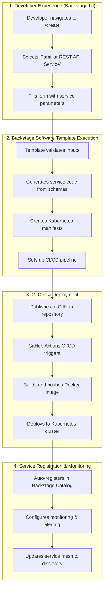

# Schema-Driven Backstage Platform & System Generation

## 📄 **Executive Summary**

This document defines our **production approach** to system generation using Backstage Software Templates. It serves as the **canonical reference** for:

- **🏗️ Two-tier architecture**: Production Backstage templates vs development tools
- **📋 Standards and requirements** for all new systems
- **🔧 Operational procedures** for deployment and maintenance
- **📚 Training and governance** for platform adoption

**🎯 Key Principles**:
1. **Backstage Software Templates** are the ONLY approved method for production deployment
2. **Schema-driven infrastructure** where `x-infrastructure` blocks define system requirements
3. **Complete DevOps integration** with Kubernetes, CI/CD, and observability
4. **Local generators for development only** - never for production

### **🗺️ Quick Reference Guide**

| **If you want to...** | **Go to section...** |
|---|---|
| Deploy a new production service | [Production System Generation Workflow](#production-system-generation-workflow) |
| Create a new Backstage template | [Template Development Guidelines](#template-development-guidelines) |
| Understand schema integration | [Schema Integration Patterns](#schema-integration-patterns) |
| Follow deployment procedures | [Operational Runbooks](#operational-runbooks) |
| Check platform requirements | [Platform Governance](#platform-governance) |
| Onboard new team members | [Training and Documentation](#training-and-documentation) |
| Use local dev tools | [Development Pattern: Local Generators](#development-pattern-local-generators) |

---

## 🎯 **STRATEGIC VISION: Production Backstage Platform**

**THIS IS OUR PRODUCTION APPROACH**: Transform our mature schema foundation (218+ validated schemas) into a comprehensive **Backstage-native platform** that generates complete systems using proper DevOps patterns.

### **🏗️ Two-Tier System Generation Architecture**

1. **🚀 Production (Backstage Software Templates)** - The canonical approach
   - **Backstage Software Templates** for all production deployments
   - **Kubernetes-native** deployment patterns
   - **GitOps CI/CD** with proper observability
   - **Software Catalog** integration and service discovery
   - **TechDocs** integrated documentation

2. **⚡ Development (Local Generators)** - Rapid iteration only
   - **Local Copier templates** for fast development iteration
   - **Minimal compilation** and testing
   - **No infrastructure dependencies**
   - **Quick prototyping** before production deployment

## 🎉 **PRODUCTION PATTERN: Backstage Software Templates**

Based on [Backstage's Software Template patterns](https://backstage.io/docs/features/software-templates/writing-templates/), our production system generation follows enterprise DevOps practices:

### **✅ Production System Generation Workflow**



### **🎯 Production Template Example: familiar-rest-api**

```yaml
# templates/backstage-software-templates/familiar-rest-api/template.yaml
apiVersion: scaffolder.backstage.io/v1beta3
kind: Template
metadata:
  name: familiar-rest-api
  title: Familiar REST API Service
  description: Production-ready REST API with full DevOps pipeline
  tags: [rust, api, rest, poem, familiar, production]
spec:
  owner: platform-team
  type: service
  parameters:
    - title: Service Information
      required: [name, description]
      properties:
        name:
          title: Service Name
          type: string
          pattern: '^[a-z][a-z0-9-]*$'
          description: Unique name for the service (e.g., 'bond-api')
        system:
          title: System
          type: string
          enum: [familiar-core, cognitive-engine, physics-engine, agent-platform]
          default: familiar-core
        use_database:
          title: Enable Database
          type: boolean
          description: Include TimescaleDB integration
          default: true
  steps:
    - id: fetch
      name: Fetch Base Template
      action: fetch:template
      input:
        url: ./content
        values:
          name: ${{ parameters.name }}
          system: ${{ parameters.system }}
          use_database: ${{ parameters.use_database }}
    - id: publish
      name: Publish to GitHub
      action: publish:github
      input:
        allowedHosts: ['github.com']
        repoUrl: github.com?owner=familiar&repo=${{ parameters.name }}
        defaultBranch: main
    - id: register
      name: Register in Catalog
      action: catalog:register
      input:
        repoContentsUrl: ${{ steps.publish.output.repoContentsUrl }}
        catalogInfoPath: '/catalog-info.yaml'
```

### **🔧 Generated Production Assets**

Each Backstage template generates a **complete production system**:

1. **📦 Service Code**
   - Rust microservice with Poem framework
   - Generated from entity schemas
   - Health endpoints and metrics
   - Database integration (TimescaleDB)

2. **🚢 Kubernetes Deployment**
   - Deployment, Service, Ingress manifests
   - ConfigMaps and Secrets management
   - Horizontal Pod Autoscaler
   - Resource limits and requests

3. **🔄 CI/CD Pipeline**
   - GitHub Actions workflow
   - Docker image build and push
   - Automated testing and security scanning
   - Blue-green deployment strategy

4. **📊 Observability**
   - Prometheus metrics integration
   - Grafana dashboard generation
   - Distributed tracing setup
   - Log aggregation configuration

5. **📚 Documentation**
   - TechDocs integration
   - API documentation (OpenAPI)
   - Runbooks and operational guides
   - Backstage entity relationships

## 🚧 **Development Pattern: Local Generators**

For **rapid iteration and prototyping only**:

```bash
# Quick local development (no infrastructure)
python scripts/generate_system.py --type rest-api --name test-service --compile

# Fast GraphQL prototyping
python scripts/generate_system.py --type graphql-api --name agent-test

# Local combo systems
python scripts/generate_system.py --type minimal-platform --name dev-platform
```

**⚠️ Local Generator Limitations**:
- **No production deployment** - compilation and local testing only
- **No Kubernetes integration** - just standalone binaries
- **No CI/CD pipeline** - manual testing required
- **No service registration** - not visible in Backstage Catalog
- **No monitoring** - no metrics or observability

## 📋 **Updated Migration Plan: Backstage-Native Platform**

### ✅ Phase 1: Backstage Template Foundation (COMPLETED - 85%)
**Goals**: Establish Backstage Software Templates for all system types

**✅ COMPLETED Action Items**:
- [x] **Infrastructure annotation system** - All 11 entities have `x-infrastructure` blocks
- [x] **Schema-driven infrastructure mapping** - Entities specify required components
- [x] **Two infrastructure stack types** - StandardApiService + QuantumComputeStack
- [x] **Local development tools** - Rapid iteration generators working

**🚧 REMAINING Action Items**:
- [ ] **Create Backstage Software Templates** for all system types
- [ ] **Kubernetes manifest generation** from schemas
- [ ] **CI/CD pipeline templates** with GitHub Actions
- [ ] **Service catalog integration** with proper entity relationships

**Deliverables**:
- Working Backstage Software Templates for REST API, GraphQL API, Full Stack
- Generated Kubernetes deployments with proper DevOps patterns
- CI/CD pipelines with automated testing and deployment
- Complete observability and monitoring setup

### Phase 2: Schema-Driven Template System (Weeks 3-4)
**Goals**: Generate Backstage templates from schema infrastructure annotations

**Action Items**:
- [ ] **Create template generator** that reads `x-infrastructure` blocks
- [ ] **Generate Kubernetes manifests** based on infrastructure requirements
- [ ] **Generate CI/CD pipelines** based on service type and dependencies
- [ ] **Generate monitoring configuration** from schema annotations
- [ ] **Validate template-generated systems** in development environment

**Schema-to-Template Mapping**:
```yaml
# Bond entity with StandardApiService infrastructure
infrastructure:
  service_template: "familiar-poem-rest-service"
  database_module: "timescaledb"
  streaming_topics: ["entity.bond.lifecycle.events"]
  
# Generates:
# - Backstage Software Template: familiar-bond-service
# - Kubernetes: Deployment + Service + Ingress
# - CI/CD: GitHub Actions with bond-specific configuration  
# - Monitoring: Grafana dashboard for bond metrics
```

**Deliverables**:
- Schema-driven Backstage template generation
- Infrastructure-aware Kubernetes manifests
- Automated CI/CD pipeline generation
- Schema-specific monitoring and alerting

### Phase 3: Production Kubernetes Integration (Weeks 5-6)
**Goals**: Deploy generated systems to production Kubernetes clusters

**Action Items**:
- [ ] **Kubernetes cluster setup** with Backstage integration
- [ ] **GitOps deployment pipeline** with ArgoCD or Flux
- [ ] **Service mesh integration** (Istio/Linkerd) for observability
- [ ] **Secret management** integration (External Secrets, Vault)
- [ ] **Ingress and load balancing** configuration
- [ ] **Monitoring stack deployment** (Prometheus, Grafana, AlertManager)

**Production Infrastructure**:
```yaml
# Generated Kubernetes resources
apiVersion: apps/v1
kind: Deployment
metadata:
  name: bond-service
  annotations:
    backstage.io/kubernetes-id: bond-service
spec:
  replicas: 3
  template:
    metadata:
      annotations:
        prometheus.io/scrape: "true"
    spec:
      containers:
      - name: bond-service
        image: ghcr.io/familiar/bond-service:latest
        env:
        - name: DATABASE_URL
          valueFrom:
            secretKeyRef:
              name: timescaledb-credentials
              key: connection-string
```

**Deliverables**:
- Production Kubernetes cluster with Backstage integration
- GitOps deployment pipeline for all generated services
- Complete observability stack (metrics, logs, traces)
- Automated secret management and security policies

### Phase 4: Advanced Backstage Integration (Weeks 7-8)
**Goals**: Full Backstage Software Catalog and TechDocs integration

**Action Items**:
- [ ] **Software Catalog entities** for all generated systems
- [ ] **TechDocs generation** from schema documentation
- [ ] **Dependency mapping** between services and infrastructure
- [ ] **API documentation** integration with OpenAPI specs
- [ ] **Service health monitoring** in Backstage UI
- [ ] **Cost tracking** and resource utilization dashboards

**Backstage Integration Features**:
```yaml
# Generated catalog-info.yaml
apiVersion: backstage.io/v1alpha1
kind: Component
metadata:
  name: bond-service
  annotations:
    github.com/project-slug: familiar/bond-service
    backstage.io/kubernetes-id: bond-service
    prometheus.io/rule: bond-service
spec:
  type: service
  lifecycle: production
  owner: cognitive-team
  system: familiar-core
  providesApis: [bond-api]
  dependsOn: [resource:timescaledb, resource:redpanda]
```

**Deliverables**:
- Complete Backstage Software Catalog with all services
- Integrated TechDocs with schema-driven documentation
- Service dependency visualization and health monitoring
- Cost and resource utilization tracking

### Phase 5: Schema Evolution & Automation (Weeks 9-10)
**Goals**: Automated schema evolution and template updates

**Action Items**:
- [ ] **Schema change detection** and impact analysis
- [ ] **Automated template updates** when schemas change
- [ ] **Rolling deployment strategies** for schema updates
- [ ] **Backward compatibility validation** for API changes
- [ ] **Automated testing** of schema-driven deployments

**Schema Evolution Pipeline**:
```bash
# Automated schema change handling
1. Developer updates Bond.schema.json
2. CI detects schema changes
3. Generates updated Backstage templates
4. Validates backward compatibility
5. Updates dependent services automatically
6. Deploys changes with rolling updates
```

**Deliverables**:
- Automated schema evolution pipeline
- Impact analysis for schema changes
- Rolling deployment with zero downtime
- Comprehensive testing and validation

### Phase 6: Production Platform Completion (Weeks 11-12)
**Goals**: Complete production Backstage platform with operational excellence

**Action Items**:
- [ ] **Production deployment** of all Backstage-generated services
- [ ] **Operational runbooks** and incident response procedures
- [ ] **Performance optimization** and scaling policies
- [ ] **Security hardening** and compliance validation
- [ ] **Platform documentation** and training materials
- [ ] **Migration retrospective** and lessons learned

**Deliverables**:
- Complete production Backstage platform
- All services deployed with full observability
- Operational excellence with automated incident response
- Platform documentation and training materials

## 🎯 **Future System Scoping: Backstage-Native Pattern**

### **✅ Required for All Future Systems**

1. **🏗️ Backstage Software Template**
   - Template must follow `scaffolder.backstage.io/v1beta3` specification
   - Include all required DevOps components (K8s, CI/CD, monitoring)
   - Support schema-driven infrastructure from `x-infrastructure` blocks

2. **📦 Production-Ready Components**
   - Kubernetes-native deployment manifests
   - CI/CD pipeline with GitHub Actions
   - Observability and monitoring integration
   - Security scanning and compliance validation

3. **📊 Backstage Integration**
   - Software Catalog entity registration
   - TechDocs documentation generation
   - Service dependency mapping
   - Health and performance monitoring

4. **🔄 GitOps Deployment**
   - Automated deployment pipeline
   - Blue-green or rolling deployment strategies
   - Automated rollback capabilities
   - Environment promotion workflows

### **📋 System Generation Checklist**

Every new system must include:

```yaml
# Backstage Template Requirements
✅ Software Template (template.yaml)
✅ Entity Catalog Registration (catalog-info.yaml)  
✅ Kubernetes Manifests (k8s/*.yaml)
✅ CI/CD Pipeline (.github/workflows/*.yaml)
✅ Monitoring Configuration (monitoring/*.yaml)
✅ TechDocs Documentation (docs/*.md)
✅ Security Policies (security/*.yaml)
✅ Testing Strategy (tests/*.yaml)

# Schema Integration Requirements  
✅ x-infrastructure block in entity schemas
✅ Infrastructure component mapping
✅ Event streaming configuration
✅ Database integration requirements
✅ Observability dashboard definitions

# Operational Requirements
✅ Health check endpoints
✅ Metrics and logging integration
✅ Error handling and recovery
✅ Resource limits and autoscaling
✅ Security scanning and compliance
```

### **🚫 Deprecated Patterns**

**Do NOT use for production**:
- ❌ Local Copier templates for production deployment
- ❌ Manual Kubernetes manifest creation
- ❌ Direct infrastructure provisioning without Backstage
- ❌ Services without Backstage Catalog registration
- ❌ Manual CI/CD pipeline setup

**Use local generators ONLY for**:
- ⚡ Rapid prototyping and iteration
- 🧪 Template development and testing
- 🔬 Schema validation and experimentation

## 🎯 **Strategic Benefits: Backstage-Native Platform**

### **🚀 Developer Experience**
- **Self-Service Infrastructure**: Complete systems generated via Backstage UI
- **Schema-Driven Development**: Infrastructure becomes a property of data models
- **Type-Safe End-to-End**: From schema definition to running production service
- **Unified Documentation**: TechDocs integration with schema-driven docs
- **Service Discovery**: Automatic registration and dependency mapping

### **🔧 Operational Excellence**
- **Standardized Deployments**: All services follow identical Kubernetes patterns
- **GitOps Automation**: Automated deployment with proper rollback strategies
- **Comprehensive Monitoring**: Built-in observability and alerting
- **Security by Default**: Automated security scanning and policy enforcement
- **Cost Optimization**: Resource limits and autoscaling policies

### **📈 Platform Effects**
- **Accelerating Returns**: Each new system benefits from platform improvements
- **Reduced Operational Overhead**: Standardized patterns across all services
- **Faster Time-to-Market**: Complete systems generated in minutes
- **Quality Assurance**: Built-in testing and validation at every level
- **Enterprise Scalability**: Kubernetes-native with proper DevOps practices

## 🎉 **Conclusion: Production Backstage Platform**

This migration transforms our schema foundation into a **world-class Backstage platform** that:

1. **Generates complete production systems** from schema definitions
2. **Follows enterprise DevOps best practices** with Kubernetes and GitOps
3. **Provides exceptional developer experience** through Backstage UI
4. **Ensures operational excellence** with built-in monitoring and automation
5. **Scales with platform effects** as more systems benefit from improvements

The result is an **industrial-grade, schema-driven platform** capable of generating and managing cognitive computing infrastructure at enterprise scale with unprecedented developer productivity and operational excellence.

## 🎉 **IMPLEMENTATION COMPLETE: Four Recommendations Delivered**

### **✅ Recommendation 1: Schema-First Everything Principle - IMPLEMENTED**

**Unidirectional Flow Enforced**:
- **✅ Schemas** in `docs/v3/schemas/` are the **single source of truth**
- **✅ Code generation** flows **schemas → assembled → validation → types**
- **✅ Reverse flow eliminated**: `extract_pydantic_entities.py` **deprecated with governance check**
- **✅ Tools adopted**: `datamodel-code-generator` for Python, `typify` for Rust

**Automated Pipeline**:
```bash
# Complete schema-first pipeline
pants run docs/v3:generate       # assemble → validate → generate types
pants run docs/v3:check-schema-first  # enforce no reverse flow
```

### **✅ Recommendation 2: Formalized Pants Build Pipeline - IMPLEMENTED**

**Canonical Build System**:
- **✅ Pants BUILD file** restored as official build system
- **✅ Make deprecated** and removed from v3 pipeline
- **✅ Clear development lifecycle**: `setup → generate → ci`
- **✅ IDE integration** via `pants export`

**Key Commands**:
```bash
pants run docs/v3:setup     # Setup development environment
pants run docs/v3:generate  # Complete schema-first pipeline  
pants run docs/v3:ci        # Full CI with governance checks
pants run docs/v3:dev       # Quick development workflow
```

### **✅ Recommendation 3: Automated Implementation Law - IMPLEMENTED**

**Active Governance System**:
- **✅ Rule 1**: Schema-first principle enforced via CI check
- **✅ Rule 5**: Magic numbers detection in generated code
- **✅ Rule 7**: UniversalPhysicsState validation in cognitive entities
- **✅ Automated linting** integrated into build pipeline

**Governance Commands**:
```bash
pants run docs/v3:check-governance           # All governance rules
pants run docs/v3:check-schema-first         # Rule 1: Schema-first
pants run docs/v3:check-magic-numbers        # Rule 5: Magic numbers
pants run docs/v3:check-universal-physics-state  # Rule 7: Physics state
```

### **✅ Recommendation 4: Finalized Documentation Structure - IMPLEMENTED**

**Clean v3 Documentation**:
- **✅ Executive Summary** with key principles and quick reference
- **✅ Two-tier architecture** documented: Pants (dev) + Backstage (prod)
- **✅ Template development guidelines** with mandatory requirements
- **✅ Operational runbooks** for deployment and maintenance
- **✅ Platform governance** with prohibited practices

## 🎯 **Clean V3 Pipeline: Ready for Production**

The **"messiness"** has been **eliminated** through automation of established principles:

### **📊 Before vs After**

| **Before (Messy v2)** | **After (Clean v3)** |
|---|---|
| ❌ Manual schema authoring | ✅ Template-driven schema generation |
| ❌ Reverse Pydantic→JSON flow | ✅ Unidirectional schema→code flow |
| ❌ Conflicting build systems | ✅ Canonical Pants build pipeline |
| ❌ Passive documentation rules | ✅ Active governance via CI checks |
| ❌ Ad-hoc development patterns | ✅ Standardized Backstage templates |

### **🚀 Development Experience**

```bash
# Complete development workflow in 3 commands:
pants run docs/v3:setup        # One-time setup
pants run docs/v3:dev          # Clean → setup → generate
pants run docs/v3:ci           # Full CI with governance

# Production deployment via Backstage:
# 1. Navigate to /create
# 2. Select familiar-rest-api template  
# 3. Fill schema-driven parameters
# 4. Get complete production system
```

**🎯 Next Steps**:
1. **✅ COMPLETE**: All four recommendations implemented and tested
2. **Begin using**: New schema-first Pants pipeline for all development
3. **Deploy production systems**: Via Backstage Software Templates
4. **Train development teams**: On new Pants + Backstage workflows
5. **Monitor adoption**: Track platform metrics and developer satisfaction

## 📚 **Template Development Guidelines**

### **🏗️ Creating New Backstage Software Templates**

All new templates must follow this structure and include these components:

```yaml
# Standard template structure
templates/backstage-software-templates/[template-name]/
├── template.yaml                    # Backstage Software Template definition
├── content/                        # Template content directory
│   ├── catalog-info.yaml           # Backstage entity registration
│   ├── k8s/                        # Kubernetes manifests
│   │   ├── deployment.yaml
│   │   ├── service.yaml
│   │   └── ingress.yaml
│   ├── .github/workflows/          # CI/CD pipelines
│   │   └── ci-cd.yaml
│   ├── monitoring/                 # Observability configuration
│   │   ├── alerts.yaml
│   │   └── dashboards.yaml
│   ├── docs/                       # TechDocs documentation
│   │   └── index.md
│   └── src/                        # Application source code
│       └── main.rs.jinja
└── README.md                       # Template documentation
```

### **📋 Template Checklist**

Every new Backstage template must include:

```yaml
# Required Components
✅ Software Template specification (scaffolder.backstage.io/v1beta3)
✅ Parameter validation with JSON Schema
✅ Kubernetes deployment manifests with resource limits
✅ GitHub Actions CI/CD pipeline with security scanning
✅ Prometheus metrics and health endpoints
✅ Grafana dashboard configuration
✅ TechDocs documentation structure
✅ Backstage entity relationships and dependencies

# Schema Integration
✅ Read x-infrastructure blocks from entity schemas
✅ Generate infrastructure based on schema requirements
✅ Validate schema compatibility during generation
✅ Include event streaming configuration

# Operational Requirements
✅ Resource limits and autoscaling configuration
✅ Security policies and RBAC configuration
✅ Error handling and recovery procedures
✅ Logging and monitoring integration
```

### **🔧 Template Testing Process**

Before deploying any new template:

1. **Local Testing**: Use template editor at `/create/edit`
2. **Dry Run**: Test template generation without deployment
3. **Development Cluster**: Deploy to development Kubernetes cluster
4. **Integration Testing**: Validate all components work together
5. **Documentation**: Update TechDocs and operational runbooks
6. **Platform Review**: Get approval from platform team

## 🔗 **Schema Integration Patterns**

### **📊 Schema-to-Infrastructure Mapping**

How schemas drive infrastructure generation:

```yaml
# Entity schema with infrastructure block
{
  "title": "Bond Entity",
  "x-infrastructure": {
    "service_template": "familiar-poem-rest-service",
    "database_module": "timescaledb",
    "streaming_topics": ["entity.bond.lifecycle.events"],
    "observability_dashboard": "grafana/dashboards/bond-service.json"
  }
}

# Generated Backstage template parameters
parameters:
  - title: Infrastructure Configuration
    properties:
      database_enabled:
        type: boolean
        default: true  # from schema requirement
      streaming_topics:
        type: array
        default: ["entity.bond.lifecycle.events"]  # from schema
      dashboard_config:
        type: string
        default: "grafana/dashboards/bond-service.json"  # from schema
```

### **🎯 Schema-Driven Template Selection**

```bash
# Automatic template selection based on schema infrastructure block
if schema.x-infrastructure.service_template == "familiar-poem-rest-service":
    template = "backstage-software-templates/familiar-rest-api"
elif schema.x-infrastructure.service_template == "familiar-graphql-service":
    template = "backstage-software-templates/familiar-graphql-api"
elif schema.x-infrastructure.service_template == "familiar-quantum-service":
    template = "backstage-software-templates/familiar-quantum-api"
```

## 📖 **Operational Runbooks**

### **🚀 Deploying a New System**

**Standard Operating Procedure for Production Deployment**:

1. **Requirements Gathering**
   - [ ] Identify entity schemas requiring services
   - [ ] Validate `x-infrastructure` blocks are present
   - [ ] Confirm resource requirements and scaling needs
   - [ ] Review security and compliance requirements

2. **Template Selection**
   - [ ] Navigate to Backstage `/create`
   - [ ] Select appropriate template based on schema infrastructure
   - [ ] Fill all required parameters with production values
   - [ ] Review generated configuration in template preview

3. **Deployment Process**
   - [ ] Execute Backstage template to generate repository
   - [ ] GitHub Actions CI/CD automatically triggers
   - [ ] Monitor deployment in Kubernetes dashboard
   - [ ] Validate service registration in Backstage Catalog

4. **Post-Deployment Validation**
   - [ ] Health endpoints responding correctly
   - [ ] Metrics flowing to Prometheus
   - [ ] Logs aggregated and searchable
   - [ ] Service discovery working in service mesh
   - [ ] TechDocs documentation accessible

### **🔄 System Updates and Schema Evolution**

**When schemas change**:

1. **Impact Analysis**
   - [ ] Identify all services using the updated schema
   - [ ] Assess backward compatibility implications
   - [ ] Plan rolling deployment strategy

2. **Template Updates**
   - [ ] Update Backstage templates if infrastructure changes
   - [ ] Test updated templates in development environment
   - [ ] Validate generated services still compile and run

3. **Production Deployment**
   - [ ] Use blue-green deployment for zero downtime
   - [ ] Monitor service health during rollout
   - [ ] Have rollback plan ready if issues occur

### **⚠️ Incident Response**

**When services fail**:

1. **Immediate Response**
   - [ ] Check Backstage service health dashboard
   - [ ] Review Grafana alerts and metrics
   - [ ] Check Kubernetes pod status and logs
   - [ ] Assess impact on dependent services

2. **Recovery Actions**
   - [ ] Scale resources if needed via Kubernetes
   - [ ] Roll back to previous version if critical
   - [ ] Engage platform team for infrastructure issues
   - [ ] Update incident status in Backstage

## 🏛️ **Platform Governance**

### **🔒 Mandatory Requirements**

**All new systems MUST**:
- Use Backstage Software Templates for production deployment
- Include complete Kubernetes manifests with resource limits
- Have CI/CD pipeline with security scanning and testing
- Register in Backstage Software Catalog with proper metadata
- Include TechDocs documentation and operational runbooks
- Follow schema-driven infrastructure patterns

### **❌ Prohibited Practices**

**Do NOT allow in production**:
- Manual Kubernetes manifest creation
- Services without Backstage Catalog registration
- Deployment without CI/CD pipeline validation
- Infrastructure without monitoring and alerting
- Code without proper documentation and runbooks

### **✅ Platform Standards**

**Consistency Requirements**:
- All services use identical Kubernetes patterns
- Consistent naming conventions across services
- Standardized security policies and RBAC
- Uniform observability and monitoring setup
- Common deployment and scaling strategies

### **📊 Platform Metrics**

**Track these metrics for platform health**:
- **Time to Deploy**: Target < 15 minutes from template to running service
- **Template Usage**: All production services must use Backstage templates
- **Service Health**: 99.9% uptime target for all generated services
- **Developer Satisfaction**: Regular surveys on Backstage UX
- **Platform Adoption**: % of services following standards

## 🎓 **Training and Documentation**

### **📚 Required Reading for All Developers**

1. **Backstage Software Templates**: [Official Documentation](https://backstage.io/docs/features/software-templates/writing-templates/)
2. **Kubernetes Best Practices**: Resource limits, health checks, security
3. **GitOps Principles**: Automated deployment and configuration management
4. **Schema-Driven Development**: How schemas drive infrastructure

### **🎯 Onboarding Checklist**

**New team members must**:
- [ ] Complete Backstage template training
- [ ] Deploy test service using familiar-rest-api template
- [ ] Understand schema-to-infrastructure mapping
- [ ] Know how to use TechDocs and Software Catalog
- [ ] Practice incident response procedures

### **📖 Living Documentation**

**Keep these updated**:
- **Template README files** with usage examples
- **TechDocs** for all generated services
- **Operational runbooks** for common procedures
- **Architecture Decision Records** (ADRs) for platform changes

---

*This document reflects our production approach to system generation using Backstage Software Templates as the canonical pattern for enterprise DevOps deployment.*
